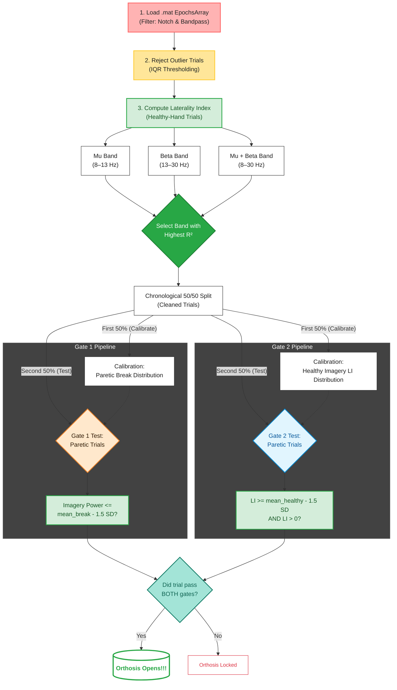

## Quick Start
1. Clone the repo: `git clone https://github.com/rat626/Smart-Stroke-Orthosis-.git`  
2. Install necessary packages and libraries: `pip install -r requirements.txt`  
3. Run the Streamlit app: `streamlit run dashboard.py`  

Hosted dashboard: https://rat626-smart-stroke-orthosis--app-lpx7i7.streamlit.app/

# BrainTrain: A BCI System to Retrain Contralateral Motor Pathways in Hemiparetic Stroke Patients

In this project, I developed a EEG-BCI pipeline that uses a dual-gait threshold to trigger a stroke orthosis/FES device to assist a patient in opening their hand on the paralyzed side of their body when sufficient motor intent is detected from the lesioned side of the brain from motor-relevant electrodes. 

I was inspired to develop this based on my experiences shadowing physical therapists who trained hemiparetic stroke patients to grip with their impaired hand and bear weight, which some were unable to do, and would use the other hand to pry open their fingers, due to inability to do so. I was also inspired by current stroke BCIs like the IpsiHand(see description in sources), which use ipsilateral intent to control an exoskeleton that assists in opening the hand. While such systems have been proven to be effective in improving quality of life for patients, I wanted to develop a system that specifically rewards patients for exercising impaired pathways in order to promote eventual neuroplasticity and recovery of intent to move the paralyzed hand using the side of the brain with a lesion. 

The data used in this pipeline comes from a study by Liu et al. 2024, which involves an 8s trial structure where participants watch a video of a hand gripping a ball, and imagining the same movement on either hand, with the neural intent to do so being captured by a 30-electrode EEG headset. The MATLAB files for each subject, along with the metadata of subjects, the specific details of their lesion, and the side of paralysis, are also included in the data subfolder. Here is a flowchart of the various steps used to process the data and evaluate the open/close state for each trial across participants. 

I also developed a Streamlit dashboard that highlights the chosen frequency band, trials used for calibration/testing, and the results of each trial, showing whether the orthosis is open/locked, and by clicking on each trial, the distribution and whether the current trial satisfies Gate 1 and 2(both gates need to be passed for the orthosis to open). I utilized a deterministic gate logic to open/close the orthosis, as I wanted to ground trial-based results in true indication of contralateral intent, first seeing if the contralateral event-related desynchronization was even significant compared to a break period, and whether there was lower power in the contralateral side compared to the ipsilateral side in the present trial, compared to the drop that would be present in healthy imagery(eg. if paralysis was on the right, lesion is in the left brain, and healthy imagery would be imagining movement of the left hand with the right brain). 

The data used to test the pipeline came from Liu et al. 2024(linked below), and I have attached addisional research publications I used to inform the usage of lateralization index and drawing from motor-related electrodes on the contralateral and ipsilateral sides to determine cases of "cheating" the system with ipsilateral overcompensation. 

These are some additional research publications I used to develop my veto/dual gate logic for triggering movement: 

Bhandari, T. (2021, April 28). Stroke-recovery device using brain-computer interface receives FDA market authorization. WashUengineers. https://engineering.washu.edu/news/2021/Stroke-recovery-device-using-brain-computer-interface-receives-FDA-market-authorization.html

Cantillo-Negrete, Jessica, et al. “The ReHand-BCI Trial: A Randomized Controlled Trial of a Brain-Computer Interface for Upper Extremity Stroke Neurorehabilitation.” Frontiers in Neuroscience, vol. 19, Frontiers Media SA, June 2025, https://doi.org/10.3389/fnins.2025.1579988.

Dodd, Keith C., et al. “Role of the Contralesional vs. Ipsilesional Hemisphere in Stroke Recovery.” Frontiers in Human Neuroscience, vol. 11, Sept. 2017, https://doi.org/10.3389/fnhum.2017.00469.

Zhang, Y.; Gao, Y.; Zhou, J.; Zhang, Z.; Feng, M.; Liu, Y. Advances in Brain-Computer Interface Controlled Functional Electrical Stimulation for Upper Limb Recovery after Stroke. Brain Research Bulletin 2025, 111354. https://doi.org/10.1016/j.brainresbull.2025.111354.

Huang, Shyh-Chour & Yusheng, Yang & Qosim, Nanang. (2020). Design and Analysis of a Dynamic Splint Based on Pulley Rotation for Post-Stroke Finger Extension Rehabilitation Device. Jurnal Rekayasa Mesin. 11. 477-485. 10.21776/ub.jrm.2020.011.03.20. 

‌
